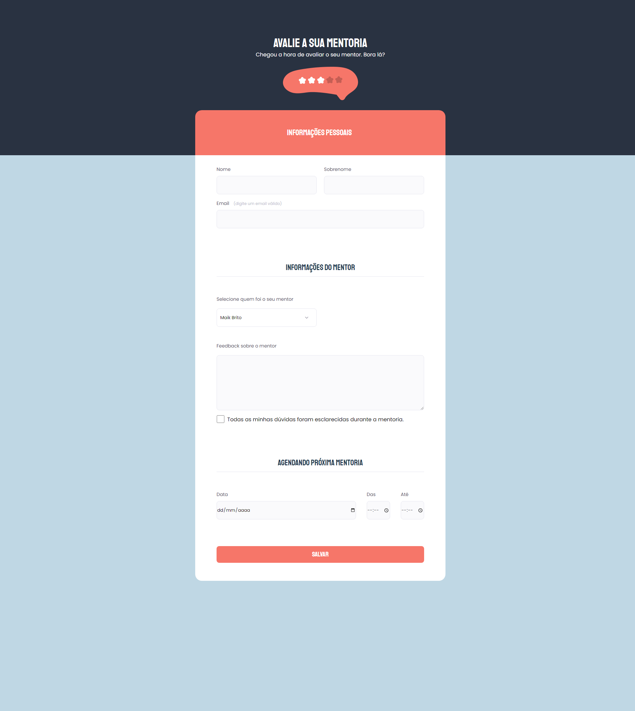

# Criando Formulario

>Desafio Turma Explorer 06

Criando formulario com html e css. Layout disponível pela figma.

🔗[Clique aqui para acessar o Formulario](https://benedirgomesneto.github.io/Formulario-de-avali--o-mentoria/)

🔗[Clique aqui para acessar o figma](https://www.figma.com/file/ENrd2EfOGNWSJkPC4WIXHh/Stage-03---Formul%C3%A1rio-avan%C3%A7ado-(Copy)?node-id=10%3A17)

## 🛠Tecnologias

- HTML
- CSS
- Git e Github
- figma

## Desafio

Desafio proposto após o fim da primeira aula do nível 3 do curso explorer. O objetivo era criar uma pagina de formulario

## 💛Contato

benedirgomesneto@gmail.com
